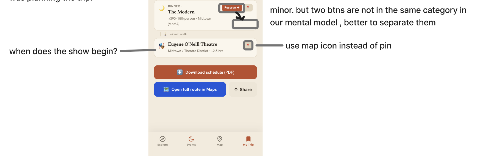

# App problem - Design  
  
# Onboarding  
  
- [ ] Establish on consistent content model and terminology across onboarding and the product: Saved -> Build a trip, or Add to trop -> Generate itinerary.  
- [ ]   
  
# Explore  
  
- [ ] Sticky header appear too large, leaving less room to browse content  
- [ ] As following image:  
  
  
  
# Map  
  
- [ ] Legends should be extended when users first enter, they can fold it manually.  
